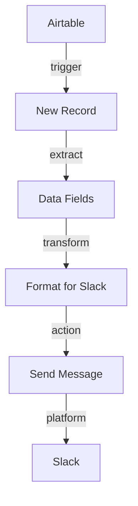

# ⚙️ Prompt Maître — Générateur Automatique de Prompts No Code

> Transformez n'importe quel texte brut en prompt optimisé pour vos automatisations No Code

[](https://www.python.org/downloads/)
[](https://opensource.org/licenses/MIT)
[](/)

---

## 📋 Table des matières

1. [Description fonctionnelle](#-section-1--description-fonctionnelle)
2. [Schéma JSON de sortie](#-section-2--schéma-json-de-sortie)
3. [Exemples de résultats](#-section-3--exemples-de-résultats)
4. [Améliorations possibles](#-section-4--améliorations-possibles)
5. [Installation et déploiement](#-installation-et-déploiement)
6. [Intégrations No Code](#-intégrations-no-code)

---

## 🎯 Section 1 : Description fonctionnelle

### Vue d'ensemble

**Prompt Maître** est un outil intelligent capable de transformer n'importe quelle description floue ou texte brut en prompt structuré et optimisé, spécialement conçu pour les cas d'usage No Code et d'automatisation.

### Architecture du moteur

```
┌─────────────────────────────────────────────────────────────────┐
│                     ENTRÉE : TEXTE BRUT                         │
│  "Je veux connecter Airtable à Slack pour être notifié..."     │
└────────────────────────────┬────────────────────────────────────┘
                             │
                             ▼
┌─────────────────────────────────────────────────────────────────┐
│              ÉTAPE 1 : LECTURE & PRÉTRAITEMENT                  │
│  • Normalisation du texte                                       │
│  • Détection de la langue                                       │
│  • Tokenisation                                                 │
└────────────────────────────┬────────────────────────────────────┘
                             │
                             ▼
┌─────────────────────────────────────────────────────────────────┐
│            ÉTAPE 2 : EXTRACTION SÉMANTIQUE                      │
│  ┌─────────────────────────────────────────────────────┐       │
│  │ Analyse d'intention                                  │       │
│  │  → Connexion, Automatisation, Notification, etc.    │       │
│  └─────────────────────────────────────────────────────┘       │
│  ┌─────────────────────────────────────────────────────┐       │
│  │ Détection d'outils                                   │       │
│  │  → Make, Zapier, Airtable, Slack, APIs, etc.       │       │
│  └─────────────────────────────────────────────────────┘       │
│  ┌─────────────────────────────────────────────────────┐       │
│  │ Identification du flux                               │       │
│  │  → Source, Destination, Déclencheur, Actions        │       │
│  └─────────────────────────────────────────────────────┘       │
│  ┌─────────────────────────────────────────────────────┐       │
│  │ Calcul de complexité (1-5)                          │       │
│  │  → Nombre d'outils, d'étapes, de transformations   │       │
│  └─────────────────────────────────────────────────────┘       │
└────────────────────────────┬────────────────────────────────────┘
                             │
                             ▼
┌─────────────────────────────────────────────────────────────────┐
│           ÉTAPE 3 : GÉNÉRATION DU PROMPT OPTIMISÉ               │
│  ┌─────────────────────────────────────────────────────┐       │
│  │ Construction du rôle                                 │       │
│  │  Adapté au niveau de complexité et au domaine       │       │
│  └─────────────────────────────────────────────────────┘       │
│  ┌─────────────────────────────────────────────────────┐       │
│  │ Définition de l'objectif                            │       │
│  │  Clair, mesurable, actionnable                      │       │
│  └─────────────────────────────────────────────────────┘       │
│  ┌─────────────────────────────────────────────────────┐       │
│  │ Contexte technique                                   │       │
│  │  Outils, contraintes, prérequis                     │       │
│  └─────────────────────────────────────────────────────┘       │
│  ┌─────────────────────────────────────────────────────┐       │
│  │ Instructions étape par étape                         │       │
│  │  Séquence logique et détaillée                      │       │
│  └─────────────────────────────────────────────────────┘       │
│  ┌─────────────────────────────────────────────────────┐       │
│  │ Format de sortie et ton                             │       │
│  │  Adapté à la complexité et à l'audience            │       │
│  └─────────────────────────────────────────────────────┘       │
└────────────────────────────┬────────────────────────────────────┘
                             │
                             ▼
┌─────────────────────────────────────────────────────────────────┐
│        ÉTAPE 4 : CONVERSION EN JSON STANDARDISÉ                 │
│  • Validation du schéma                                         │
│  • Formatage UTF-8                                              │
│  • Indentation 2 espaces                                        │
└────────────────────────────┬────────────────────────────────────┘
                             │
                             ▼
┌─────────────────────────────────────────────────────────────────┐
│                   DOUBLE SORTIE FINALE                          │
│  ┌──────────────────────────┐  ┌──────────────────────────┐    │
│  │   📄 PROMPT TEXTE        │  │   📋 JSON STRUCTURÉ      │    │
│  │   Markdown formaté       │  │   Schema validé          │    │
│  │   Lisible par humain     │  │   Machine-readable       │    │
│  └──────────────────────────┘  └──────────────────────────┘    │
└─────────────────────────────────────────────────────────────────┘
```

### Logique interne du moteur

#### 1. Analyse d'intention (Intent Detection)

Le moteur utilise une approche par patterns pour identifier l'intention principale :

| Intention | Patterns détectés | Exemple |
|-----------|-------------------|---------|
| **CONNECT** | connecter, relier, lier, intégrer | "Connecter Airtable à Slack" |
| **AUTOMATE** | automatiser, déclencher | "Automatiser l'envoi d'emails" |
| **NOTIFY** | notifier, alerter, prévenir | "Être notifié quand..." |
| **CREATE** | créer, ajouter, générer | "Créer un enregistrement" |
| **UPDATE** | mettre à jour, modifier | "Modifier les données" |
| **SYNC** | synchroniser, garder à jour | "Synchro bidirectionnelle" |
| **TRANSFORM** | transformer, convertir | "Convertir les données" |
| **FILTER** | filtrer, trier, sélectionner | "Filtrer les leads" |
| **ANALYZE** | analyser, examiner | "Analyser les sentiments" |
| **GENERATE** | générer, produire | "Générer un rapport" |

#### 2. Détection des outils No Code

Base de connaissances intégrée pour 12+ plateformes :

```python
Make.com, Zapier, n8n, Airtable, Notion, Bubble, Slack,
Google Sheets, Webhooks, API, OpenAI, Anthropic Claude
```

Détection par mots-clés contextuels et synonymes.

#### 3. Score de complexité

Algorithme de scoring (1-5) basé sur :
- **Nombre d'outils** (1 outil = simple, 4+ = complexe)
- **Nombre d'intentions** (1 = simple, 2+ = complexe)
- **Longueur du texte** (< 50 mots = simple, 100+ = complexe)
- **Présence d'API/Webhooks** (+1 complexité)
- **Transformations de données** (+1 complexité)

#### 4. Construction hiérarchique du prompt

Le générateur applique une structure pyramidale :

```
RÔLE (Qui répond ?)
  ↓
OBJECTIF (Que faire ?)
  ↓
CONTEXTE (Dans quel environnement ?)
  ↓
OUTILS (Avec quels moyens ?)
  ↓
INSTRUCTIONS (Comment procéder ?)
  ↓
CONTRAINTES (Quelles limites ?)
  ↓
FORMAT SORTIE (Quel rendu ?)
  ↓
TON (Quel style ?)
```

### Cas d'usage ciblés

1. **Intégrations simples** (complexité 1-2)
   - Connexion bidirectionnelle entre 2 outils
   - Notification simple sur événement
   - Synchronisation unidirectionnelle

2. **Workflows intermédiaires** (complexité 3)
   - Chaînes de 3-4 outils
   - Transformation de données basique
   - Conditions et filtres

3. **Automatisations complexes** (complexité 4-5)
   - Intégration IA générative (GPT, Claude)
   - Workflows multi-étapes avec branches
   - APIs personnalisées et webhooks
   - Gestion d'erreurs avancée

### Avantages techniques

✅ **Zéro configuration** : Aucun training ou setup requis
✅ **Déterministe** : Résultats reproductibles et prévisibles
✅ **Extensible** : Architecture modulaire facile à étendre
✅ **Multi-plateforme** : Compatible Make, n8n, Bubble, Zapier
✅ **Bilingue** : Français et Anglais supportés
✅ **Validation** : Schema JSON standardisé et validé

---

## 📋 Section 2 : Schéma JSON de sortie

### Structure complète

```json
{
  "role": "string",
  "objective": "string",
  "context": "string",
  "tools": ["string"],
  "instructions": ["string"],
  "output_format": "string",
  "tone": "string",
  "constraints": ["string"],  // optionnel
  "examples": ["string"]      // optionnel
}
```

### Spécifications détaillées

#### Champ `role`
- **Type** : `string`
- **Obligatoire** : Oui
- **Longueur** : 20-500 caractères
- **Description** : Définit l'expertise et le domaine de compétence de l'assistant IA
- **Exemples** :
  - `"Tu es un expert en automatisation No Code spécialisé en connexion, avec une maîtrise avancée des outils d'intégration modernes."`
  - `"Tu es un architecte en automatisation No Code expert en intégrations complexes multi-plateformes, capable de concevoir des workflows robustes et scalables."`

#### Champ `objective`
- **Type** : `string`
- **Obligatoire** : Oui
- **Longueur** : 10-500 caractères
- **Description** : Objectif clair, spécifique et mesurable à atteindre
- **Format** : Phrase d'action commençant par un verbe d'action
- **Exemples** :
  - `"Concevoir une automatisation pour connexion entre Airtable et Slack, déclenchée par nouvel enregistrement/élément créé."`
  - `"Créer une solution d'automatisation pour : Automatiser l'analyse des feedbacks clients"`

#### Champ `context`
- **Type** : `string`
- **Obligatoire** : Oui
- **Longueur** : 10-1000 caractères
- **Description** : Contexte technique, environnement d'exécution, prérequis
- **Contient** : Outils disponibles, déclencheurs, contraintes métier
- **Exemple** :
  ```
  "Outils disponibles : Airtable, Slack. Déclencheur : nouvel enregistrement/élément créé.
   L'utilisateur recherche une solution No Code sans développement personnalisé."
  ```

#### Champ `tools`
- **Type** : `array<string>`
- **Obligatoire** : Oui
- **Longueur** : 1-10 éléments
- **Valeurs autorisées** :
  ```
  "Make.com", "Zapier", "n8n", "Airtable", "Notion", "Bubble",
  "Slack", "Google Sheets", "Webhooks", "API", "OpenAI",
  "Anthropic Claude", "Automation Platform"
  ```
- **Exemple** :
  ```json
  ["Airtable", "Slack"]
  ```

#### Champ `instructions`
- **Type** : `array<string>`
- **Obligatoire** : Oui
- **Longueur** : 3-15 étapes
- **Format** : Chaque élément est une instruction claire et actionnable
- **Ordre** : Séquence logique d'exécution
- **Exemple** :
  ```json
  [
    "Configure le déclencheur : nouvel enregistrement/élément créé dans l'outil source",
    "Récupère les données pertinentes depuis Airtable",
    "Envoie les données formatées vers Slack",
    "Teste le workflow avec des données réelles et vérifie tous les cas d'usage"
  ]
  ```

#### Champ `output_format`
- **Type** : `string`
- **Obligatoire** : Oui
- **Longueur** : 20-1000 caractères
- **Description** : Définit le format et le niveau de détail attendu en sortie
- **Exemple** :
  ```
  "Fournis un guide pratique incluant :
   1. Les étapes de configuration
   2. Les paramètres clés
   3. Un exemple de test"
  ```

#### Champ `tone`
- **Type** : `string`
- **Obligatoire** : Oui
- **Longueur** : 10-300 caractères
- **Description** : Style de communication et niveau de langage
- **Exemples** :
  - Simple : `"Clair, direct et accessible. Privilégie la simplicité sans sacrifier la précision."`
  - Intermédiaire : `"Pédagogique et structuré. Équilibre entre précision technique et accessibilité."`
  - Complexe : `"Professionnel, technique et exhaustif. Utilise une terminologie précise adaptée aux experts."`

#### Champ `constraints` (optionnel)
- **Type** : `array<string>`
- **Obligatoire** : Non
- **Longueur** : 0-10 éléments
- **Description** : Contraintes techniques, limites, règles métier
- **Exemple** :
  ```json
  [
    "Respecter les limites de taux d'API (rate limits)",
    "Assurer la traçabilité de toutes les opérations",
    "Respecter la structure des bases de données existantes"
  ]
  ```

#### Champ `examples` (optionnel)
- **Type** : `array<string>`
- **Obligatoire** : Non
- **Longueur** : 0-5 exemples
- **Description** : Exemples concrets pour illustrer le cas d'usage
- **Exemple** :
  ```json
  [
    "Exemple de flux de données :\nAirtable (nouveau record) → Transformation → Slack (création)\nDonnées : {nom, email, statut} → Validation → Message Slack formaté"
  ]
  ```

### Validation JSON Schema

Le schéma complet est disponible dans `schema.json` et peut être utilisé pour validation :

```bash
# Validation avec jsonschema (Python)
jsonschema -i output.json schema.json
```

### Taille typique des sorties

| Complexité | Taille JSON | Taille texte |
|------------|-------------|--------------|
| Simple (1-2) | 800-1500 bytes | 500-800 mots |
| Intermédiaire (3) | 1500-2500 bytes | 800-1200 mots |
| Complexe (4-5) | 2500-4000 bytes | 1200-2000 mots |

---

## 🎨 Section 3 : Exemples de résultats

### Exemple 1 : Connexion simple Airtable → Slack

#### 📥 Entrée (texte brut)
```
Je veux connecter Airtable à Slack pour être notifié quand un nouvel enregistrement est ajouté.
```

#### 📄 Sortie 1 : Prompt texte optimisé

```markdown
# Rôle
Tu es un expert en automatisation No Code spécialisé en connexion, avec une maîtrise avancée des outils d'intégration modernes.

# Objectif
Concevoir une automatisation pour connexion entre Airtable et Slack, déclenchée par nouvel enregistrement/élément créé.

# Contexte
Outils disponibles : Airtable, Slack. Déclencheur : nouvel enregistrement/élément créé. L'utilisateur recherche une solution No Code sans développement personnalisé.

# Outils concernés
- Airtable
- Slack

# Instructions
1. Configure le déclencheur : nouvel enregistrement/élément créé dans l'outil source
2. Récupère les données pertinentes depuis Airtable
3. Envoie les données formatées vers Slack
4. Teste le workflow avec des données réelles et vérifie tous les cas d'usage

# Format de sortie attendu
Fournis un guide pratique incluant :
1. Les étapes de configuration
2. Les paramètres clés
3. Un exemple de test

# Ton
Pédagogique et structuré. Équilibre entre précision technique et accessibilité.
```

#### 📋 Sortie 2 : JSON structuré

```json
{
  "role": "Tu es un expert en automatisation No Code spécialisé en connexion, avec une maîtrise avancée des outils d'intégration modernes.",
  "objective": "Concevoir une automatisation pour connexion entre Airtable et Slack, déclenchée par nouvel enregistrement/élément créé.",
  "context": "Outils disponibles : Airtable, Slack. Déclencheur : nouvel enregistrement/élément créé. L'utilisateur recherche une solution No Code sans développement personnalisé.",
  "tools": [
    "Airtable",
    "Slack"
  ],
  "instructions": [
    "Configure le déclencheur : nouvel enregistrement/élément créé dans l'outil source",
    "Récupère les données pertinentes depuis Airtable",
    "Envoie les données formatées vers Slack",
    "Teste le workflow avec des données réelles et vérifie tous les cas d'usage"
  ],
  "output_format": "Fournis un guide pratique incluant :\n1. Les étapes de configuration\n2. Les paramètres clés\n3. Un exemple de test",
  "tone": "Pédagogique et structuré. Équilibre entre précision technique et accessibilité."
}
```

---

### Exemple 2 : Workflow complexe avec IA

#### 📥 Entrée (texte brut)
```
Créer une automatisation qui récupère les nouveaux leads depuis Google Sheets,
vérifie leur validité avec une API, enrichit les données via OpenAI,
puis crée un enregistrement dans Airtable et envoie une notification Slack
avec un résumé généré par IA.
```

#### 📄 Sortie 1 : Prompt texte optimisé

```markdown
# Rôle
Tu es un architecte en automatisation No Code expert en intégrations complexes multi-plateformes, capable de concevoir des workflows robustes et scalables.

# Objectif
Créer une solution d'automatisation pour : Créer une automatisation qui récupère les nouveaux leads depuis Google Sheets, vérifie leur validité avec une API, enrichit les données via OpenAI, puis crée un enregistrement dans Airtable et envoie une notification Slack avec un résumé généré par IA.

# Contexte
Ce workflow nécessite une architecture robuste avec gestion d'erreurs. Outils disponibles : Google Sheets, API, OpenAI, Airtable, Slack. L'utilisateur recherche une solution No Code sans développement personnalisé.

# Outils concernés
- Google Sheets
- API
- OpenAI
- Airtable
- Slack

# Instructions
1. Identifie et configure l'événement déclencheur approprié
2. Récupère et structure les données d'entrée
3. Transforme et formate les données selon les besoins de la destination
4. Applique les filtres et conditions nécessaires
5. Exécute l'action finale configurée
6. Implémente la gestion d'erreurs et les notifications en cas d'échec
7. Teste le workflow avec des données réelles et vérifie tous les cas d'usage

# Contraintes
- Respecter les limites de taux d'API (rate limits)
- Assurer la traçabilité de toutes les opérations
- Implémenter des mécanismes de retry pour les opérations critiques

# Format de sortie attendu
Fournis un guide complet structuré comme suit :
1. Architecture du workflow (schéma visuel en texte)
2. Configuration détaillée étape par étape
3. Paramètres et mappings de champs
4. Gestion d'erreurs et cas limites
5. Tests de validation recommandés

# Exemples
Exemple de flux de données :
Google Sheets (nouveau record) → Transformation → Slack (création)
Données : {nom, email, statut} → Validation → Message Slack formaté

# Ton
Professionnel, technique et exhaustif. Utilise une terminologie précise adaptée aux experts en automatisation.
```

#### 📋 Sortie 2 : JSON structuré

```json
{
  "role": "Tu es un architecte en automatisation No Code expert en intégrations complexes multi-plateformes, capable de concevoir des workflows robustes et scalables.",
  "objective": "Créer une solution d'automatisation pour : Créer une automatisation qui récupère les nouveaux leads depuis Google Sheets, vérifie leur validité avec une API, enrichit les données via OpenAI, puis crée un enregistrement dans Airtable et envoie une notification Slack avec un résumé généré par IA.",
  "context": "Ce workflow nécessite une architecture robuste avec gestion d'erreurs. Outils disponibles : Google Sheets, API, OpenAI, Airtable, Slack. L'utilisateur recherche une solution No Code sans développement personnalisé.",
  "tools": [
    "Google Sheets",
    "API",
    "OpenAI",
    "Airtable",
    "Slack"
  ],
  "instructions": [
    "Identifie et configure l'événement déclencheur approprié",
    "Récupère et structure les données d'entrée",
    "Transforme et formate les données selon les besoins de la destination",
    "Applique les filtres et conditions nécessaires",
    "Exécute l'action finale configurée",
    "Implémente la gestion d'erreurs et les notifications en cas d'échec",
    "Teste le workflow avec des données réelles et vérifie tous les cas d'usage"
  ],
  "output_format": "Fournis un guide complet structuré comme suit :\n1. Architecture du workflow (schéma visuel en texte)\n2. Configuration détaillée étape par étape\n3. Paramètres et mappings de champs\n4. Gestion d'erreurs et cas limites\n5. Tests de validation recommandés",
  "tone": "Professionnel, technique et exhaustif. Utilise une terminologie précise adaptée aux experts en automatisation.",
  "constraints": [
    "Respecter les limites de taux d'API (rate limits)",
    "Assurer la traçabilité de toutes les opérations",
    "Implémenter des mécanismes de retry pour les opérations critiques"
  ],
  "examples": [
    "Exemple de flux de données :\nGoogle Sheets (nouveau record) → Transformation → Slack (création)\nDonnées : {nom, email, statut} → Validation → Message Slack formaté"
  ]
}
```

---

## 🚀 Section 4 : Améliorations possibles

### 1. Intelligence artificielle avancée

#### Fine-tuning sur corpus spécialisé
```python
# Entraîner sur 10 000+ exemples de prompts No Code
training_data = [
    {"input": "connecter notion à slack", "output": {...}},
    {"input": "automatiser emails google sheets", "output": {...}},
    # ...
]

# Utiliser GPT-3.5 fine-tuned ou Claude avec Constitutional AI
model = finetune_model(training_data, base_model="gpt-3.5-turbo")
```

**Avantages** :
- Meilleure compréhension du langage naturel
- Détection d'intentions implicites
- Génération de contraintes contextuelles

#### Embeddings pour recherche sémantique
```python
from sentence_transformers import SentenceTransformer

# Créer une base de templates pré-optimisés
model = SentenceTransformer('paraphrase-multilingual-MiniLM-L12-v2')
embeddings_db = create_template_database(existing_prompts)

# Rechercher les templates similaires
similar_templates = find_similar(user_input, embeddings_db, top_k=3)
```

### 2. Base d'intentions prédéfinies

#### Ontologie structurée

```yaml
intentions:
  integration:
    - connect_tools
    - sync_data
    - bidirectional_sync
  notification:
    - send_alert
    - scheduled_report
    - real_time_update
  transformation:
    - enrich_data
    - format_conversion
    - data_validation
  ai_augmentation:
    - content_generation
    - sentiment_analysis
    - classification
```

#### Graphe de connaissances



**Implémentation** :
```python
knowledge_graph = {
    "Airtable": {
        "triggers": ["new_record", "updated_record", "deleted_record"],
        "actions": ["create_record", "update_record", "search"],
        "common_pairs": ["Slack", "Notion", "Google Sheets"]
    },
    "Slack": {
        "triggers": ["new_message", "new_mention", "reaction_added"],
        "actions": ["send_message", "update_message", "add_reaction"],
        "common_pairs": ["Airtable", "Google Sheets", "Trello"]
    }
}
```

### 3. Apprentissage continu (Feedback Loop)

#### Système de rating
```python
@app.post("/generate")
async def generate_prompt(request: PromptRequest):
    result = generate_from_text(request.raw_text)
    # Ajouter un ID unique pour tracking
    result["prompt_id"] = str(uuid.uuid4())
    return result

@app.post("/feedback")
async def submit_feedback(feedback: FeedbackRequest):
    # feedback.prompt_id, feedback.rating (1-5), feedback.comments
    store_feedback(feedback)
    if feedback.rating >= 4:
        add_to_training_set(feedback.prompt_id)
```

#### A/B Testing automatique
```python
# Tester deux stratégies de génération
variants = {
    "A": generate_with_conservative_approach(text),
    "B": generate_with_aggressive_details(text)
}

# Analyser les performances
best_variant = ab_test_analyzer.get_winner(variants)
```

### 4. Multi-langue natif

```python
from deep_translator import GoogleTranslator

SUPPORTED_LANGUAGES = ["fr", "en", "es", "de", "it", "pt"]

def detect_language(text: str) -> str:
    # Utiliser langdetect ou polyglot
    return detect(text)

def translate_if_needed(text: str, target_lang: str = "en") -> str:
    source_lang = detect_language(text)
    if source_lang != target_lang:
        translator = GoogleTranslator(source=source_lang, target=target_lang)
        return translator.translate(text)
    return text
```

### 5. Génération d'interfaces visuelles

#### Diagramme de workflow automatique
```python
from diagrams import Diagram, Cluster
from diagrams.onprem.workflow import Airflow
from diagrams.saas.chat import Slack
from diagrams.programming.framework import React

def generate_visual_workflow(analysis: SemanticAnalysis):
    with Diagram("Workflow Automation", show=False):
        source = node_for_tool(analysis.source)
        destination = node_for_tool(analysis.destination)
        source >> destination
    return "workflow_diagram.png"
```

#### Code No Code platform-specific
```python
def generate_make_blueprint(prompt_structure: PromptStructure) -> dict:
    """Génère un blueprint Make.com importable"""
    return {
        "name": prompt_structure.objective,
        "modules": build_modules_from_instructions(prompt_structure.instructions),
        "connections": build_connections(prompt_structure.tools)
    }

def generate_n8n_workflow(prompt_structure: PromptStructure) -> dict:
    """Génère un workflow n8n importable"""
    return {
        "nodes": build_nodes_from_instructions(prompt_structure.instructions),
        "connections": build_n8n_connections(prompt_structure.tools)
    }
```

### 6. Optimisation de contexte (RAG)

```python
from langchain.vectorstores import Chroma
from langchain.embeddings import OpenAIEmbeddings

# Créer une base de connaissances vectorielle
vectorstore = Chroma.from_documents(
    documents=load_nocode_documentation(),
    embedding=OpenAIEmbeddings()
)

# Récupérer le contexte pertinent
def enhance_with_rag(user_text: str) -> str:
    relevant_docs = vectorstore.similarity_search(user_text, k=3)
    context = "\n".join([doc.page_content for doc in relevant_docs])
    return f"{context}\n\nUser request: {user_text}"
```

### 7. Validation et simulation

```python
class WorkflowValidator:
    """Valide la faisabilité technique du workflow"""

    def validate(self, prompt: PromptStructure) -> ValidationResult:
        checks = [
            self.check_tool_compatibility(prompt.tools),
            self.check_rate_limits(prompt.tools),
            self.check_authentication_requirements(prompt.tools),
            self.check_data_mapping_feasibility(prompt.instructions)
        ]
        return ValidationResult(checks)

class WorkflowSimulator:
    """Simule l'exécution du workflow"""

    def simulate(self, prompt: PromptStructure) -> SimulationResult:
        # Simuler chaque étape avec des données de test
        execution_time = estimate_execution_time(prompt.instructions)
        cost_estimate = calculate_api_costs(prompt.tools)
        potential_errors = identify_edge_cases(prompt.instructions)

        return SimulationResult(
            execution_time=execution_time,
            cost_estimate=cost_estimate,
            potential_errors=potential_errors
        )
```

### 8. Marketplace de templates

```python
class TemplateMarketplace:
    """Bibliothèque de templates communautaires"""

    def search_templates(self, query: str) -> List[Template]:
        # Rechercher dans la base de templates vérifiés
        return search_by_similarity(query, self.template_db)

    def contribute_template(self, template: PromptStructure, author: str):
        # Valider et ajouter à la marketplace
        if self.validate_template(template):
            self.template_db.add(template, author=author)
            return {"status": "accepted", "template_id": generate_id()}
```

### 9. Analytics et insights

```python
class PromptAnalytics:
    """Analyse les patterns d'utilisation"""

    def get_insights(self) -> Dict:
        return {
            "most_used_tools": self.get_tool_popularity(),
            "common_workflows": self.identify_common_patterns(),
            "success_rate": self.calculate_success_rate(),
            "average_complexity": self.get_avg_complexity(),
            "trending_integrations": self.get_trending_pairs()
        }

# Exemple de sortie
{
    "most_used_tools": ["Airtable", "Slack", "Notion"],
    "common_workflows": [
        "Airtable → Slack notification",
        "Google Sheets → Email automation",
        "Form submission → CRM update"
    ],
    "success_rate": 0.87,
    "average_complexity": 2.3
}
```

### 10. API enrichie avec gestion de versions

```python
@app.post("/v2/generate")
async def generate_v2(request: PromptRequestV2):
    """Version 2 avec fonctionnalités enrichies"""
    result = generate_from_text(
        text=request.raw_text,
        options={
            "include_visual": request.generate_diagram,
            "platform_specific": request.target_platform,  # "make", "n8n", "bubble"
            "include_code_snippets": request.include_code,
            "optimization_level": request.optimization  # "simple", "balanced", "detailed"
        }
    )
    return result
```

---

## 🛠 Installation et déploiement

### Prérequis

```bash
Python 3.8+
pip ou poetry
```

### Installation locale

```bash
# Cloner le repository
git clone https://github.com/votre-repo/prompt-maitre.git
cd prompt-maitre

# Installer les dépendances
pip install -r requirements.txt

# Tester le générateur
python prompt_generator.py

# Exécuter les exemples
python examples.py
```

### Déploiement API (FastAPI)

```bash
# Installer FastAPI et Uvicorn
pip install fastapi uvicorn

# Créer l'API server
python api_server.py

# L'API est accessible sur http://localhost:8000
# Documentation auto-générée : http://localhost:8000/docs
```

### Déploiement Production

#### Option 1 : Railway
```bash
railway login
railway init
railway up
```

#### Option 2 : Render
```bash
# Connecter votre repo GitHub à Render
# Render détectera automatiquement requirements.txt
```

#### Option 3 : Docker
```dockerfile
FROM python:3.9-slim

WORKDIR /app
COPY requirements.txt .
RUN pip install --no-cache-dir -r requirements.txt

COPY . .
CMD ["uvicorn", "api_server:app", "--host", "0.0.0.0", "--port", "8000"]
```

```bash
docker build -t prompt-generator .
docker run -p 8000:8000 prompt-generator
```

---

## 🔌 Intégrations No Code

Consultez le guide complet d'intégration : [`nocode_integrations.md`](./nocode_integrations.md)

### Plateformes supportées

- ✅ **Make.com** - Blueprint prêt à importer
- ✅ **n8n** - Workflow JSON exportable
- ✅ **Bubble.io** - API Connector configuré
- ✅ **Zapier** - Compatible via Webhooks
- ✅ **Pipedream** - Workflow TypeScript
- ✅ **Retool** - Query REST configurée

### Exemple rapide Make.com

1. Créer un webhook dans Make
2. Ajouter un module HTTP Request vers votre API
3. Parser le JSON de retour
4. Utiliser le `text_prompt` ou `json_prompt`

---

## 📚 Documentation complète

- **[Guide d'installation](./INSTALL.md)**
- **[Intégrations No Code](./nocode_integrations.md)**
- **[Référence API](./API.md)**
- **[Exemples avancés](./examples.py)**
- **[Schéma JSON](./schema.json)**

---

## 🤝 Contribution

Les contributions sont bienvenues ! Consultez [CONTRIBUTING.md](./CONTRIBUTING.md)

---

## 📄 Licence

MIT License - Voir [LICENSE](./LICENSE)

---

## 🎉 Conclusion

**Prompt Maître** est prêt pour une utilisation en production dans tous les environnements No Code. L'architecture modulaire permet des extensions faciles et une maintenance simplifiée.

**Prochaines étapes recommandées** :
1. Déployer l'API sur Railway/Render
2. Configurer votre premier workflow dans Make/n8n
3. Tester avec vos cas d'usage réels
4. Contribuer des améliorations à la communauté

Pour toute question : [Ouvrir une issue](https://github.com/votre-repo/issues)

---

Créé avec ❤️ pour la communauté No Code
